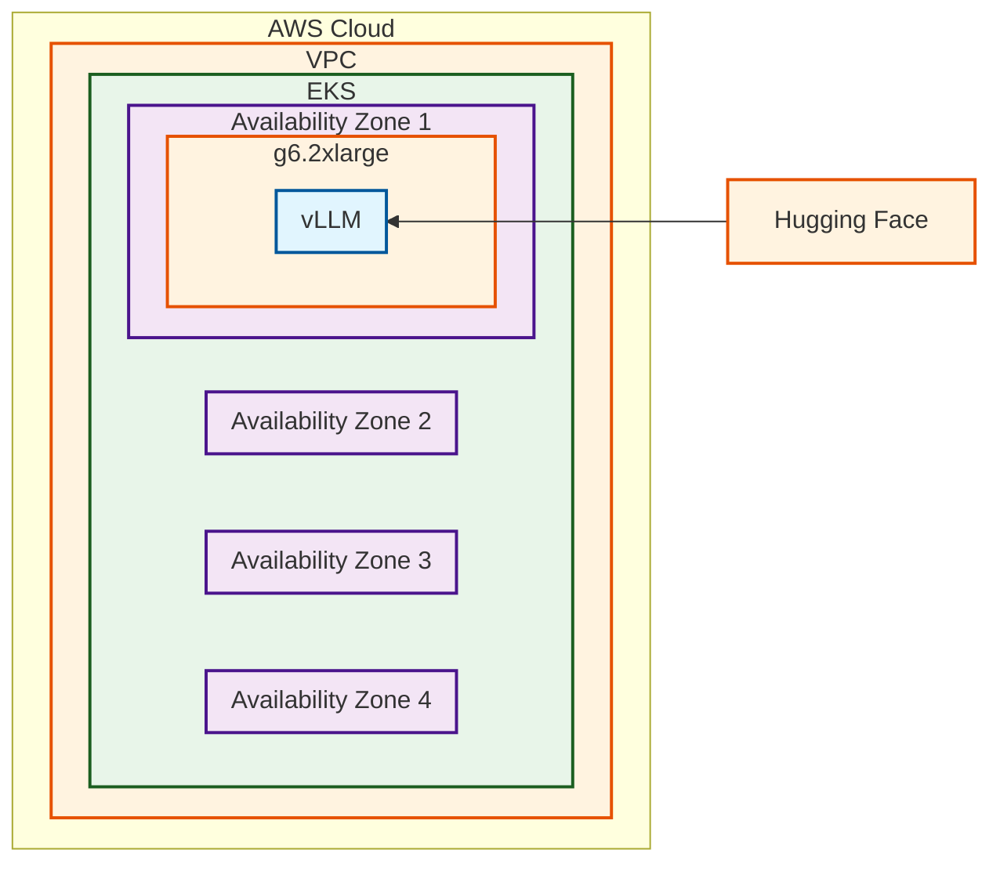

# Model Deployment

There are over 250,000 Text Generation models
on [Hugging Face](https://huggingface.co/models?pipeline_tag=text-generation&sort=trending). Finding the right model for
the job can be daunting when getting started with LLM inference. There are a multitude of considerations:

- Accuracy: How well does the model generate text?
- Parameter count: The larger the model is, the more compute is required to run it
- Latency: How long does the model take to run a request? Does it fall within your desired SLOs?
- Licensing: Is the licensing of the model permissive to your use case?
- Customization Capabilities: Can you fine-tune the LLM on your data?
- Capabilities: Does the model work for the task you need?
- Ethical considerations: Is the model trained on data you find ethical? Is the model trained to not answer specific
  questions?

A general rule of thumb is to check an open weights leaderboard such
as [artificialanalysis.ai](https://artificialanalysis.ai/leaderboards/models?open_weights=open_source) to see the
current crop of models. Another possibility is to look at
the [Hugging Face trending models](https://huggingface.co/models?pipeline_tag=text-generation&sort=trending) to see
which ones are the current most popular. Starting with a tiny or small model can highlight a model's capabilities
without requiring a large upfront cost. Once you identify a model to test, you will want to deploy it and test it with a
sample prompt.

Let's take a look at the architecture for that

## Architecture



### Architecture Decisions

Model: [Qwen3-1.7B](https://huggingface.co/Qwen/Qwen3-1.7B). Qwen 3 1.7B is a very small open weights model.
It supports text generation and is a capable first model for illustrating LLM capabilities.

Inference Engine: [vLLM](https://github.com/vllm-project/vllm). vLLM is a popular, open source, inference engine that is
easy to deploy in a Kubernetes
environment and supports [many models](https://docs.vllm.ai/en/latest/models/supported_models.html). It supports
[multiple accelerators](https://docs.vllm.ai/en/latest/features/quantization/supported_hardware.html), making it a great
way to quickly deploy your first model.

Instance Type: g6.2xlarge. The `g6.2xlarge` instance has an Nvidia L4 accelerator with 24 GiB of GPU memory. The
instance has 8 vCPUs and 32 GiB of RAM. For the most current pricing, please
see [here](https://aws.amazon.com/ec2/pricing/on-demand/).

It is important to match the instance type to the model you would like to run. If you deviate from this configuration,
that's ok, but you need to keep in mind the memory requirements of an LLM. A general equation is:

$$
Memory=Parameters * \frac{Precision}{8} * Overhead\\\
\text{Memory = Number of GiB required for Accelerator} \\\
\text{Parameters = Number of parameters in model (e.g. 1B)} \\\
\text{Precision=How many bits the model is using } \\\
\text{Overhead=% overhead for activations }
$$

https://blog.eleuther.ai/transformer-math/

Let's take the Qwen3-1.7B
example ([bf16](https://huggingface.co/Qwen/Qwen3-1.7B/blob/main/config.json#L25)):
$$
Memory=Parameters * \frac{Precision}{8} * 1.2\\\
\\\
Memory=1.7B * \frac{16}{8} * Overhead\\\
\\\
Memory=3.4 GiB * Overhead
$$

Overhead accounts for the components of the model above the static
memory (https://tensorwave.com/blog/estimating-llm-inference-memory-requirements). These include activation memory and
KV Cache. Activation memory is estimated at about 25% of the static memory. In the Qwen 3 example, we'd need to budget
another 0.85 GiB.

Finally, the KV cache is the largest portion of the dynamic memory. The KV Cache per token calculation is:
KV Cache per Token = 2 * Precision * Layers * Hidden Dimension
KV Cache per Token = 2 * 2 Bytes * 28 * 2048 = 0.2 MB per token

But we need to look at the total KV cache, which is:
Total KV Cache = KV Cache per Token * Context Length * Concurrent Requests
Total KV Cache = 0.2 * 8192 * 1 = 1.6GiB

Total Required memory for 1 concurrent request at 8192 context length = 3.4 GiB + 0.85 Gib + 1.6 Gib = 5.85 Gib

The `g6.2xlarge` has 24 GiB of GPU memory, which is more than 5.85 GiB, so the model will fit with room to spare.

## Deployment

This deployment assumes you are using
the [Inference Ready Cluster](https://awslabs.github.io/ai-on-eks/docs/infra/inference-ready-cluster) solution, which
supports deployments using multiple frameworks and accelerators.

### Inference Charts

This architecture is available in the AI on
EKS [inference charts](https://github.com/awslabs/ai-on-eks-charts/blob/main/charts/inference-charts/README.md). Before
deploying the chart, you will need to create a Hugging Face token and add it to your environment. You can follow the
instructions
at  [inference charts](https://github.com/awslabs/ai-on-eks-charts/blob/main/charts/inference-charts/README.md#create-hugging-face-token-secret)
to create your token.

```bash
helm repo add ai-on-eks https://awslabs.github.io/ai-on-eks-charts/
helm repo update

helm template ai-on-eks/inference-charts --values https://raw.githubusercontent.com/awslabs/ai-on-eks-charts/refs/heads/main/charts/inference-charts/values-qwen3-1.7b-vllm.yaml | kubectl apply -f -
```

This will deploy the vLLM container, which will pull the weights from Hugging Face and load the model.

## Use the Model

You will want to make sure your container is running with:

```bash
kubectl get po

NAME                                READY   STATUS              RESTARTS   AGE
qwen3-1-7b-vllm-5ffdcdddcf-gzwnn   0/1     Running             0          2m
```

Once the container is running, you can get the logs on it with

```bash
kubectl logs -l app.kubernetes.io/component=qwen-3-1-7b-vllm -f
```

You will see some output, when you see

```
INFO:     Started server process [7]
INFO:     Waiting for application startup.
INFO:     Application startup complete.
```

the server is running. Press `ctrl + c` to stop following the logs.

You can now port-forward the endpoint to your local computer:

```bash
kubectl port-forward svc/qwen3-1-7b-vllm 8000
```

In another terminal window, you can now send a request to the model:

```bash
curl --location 'http://localhost:8000/v1/chat/completions' \
--header 'Content-Type: application/json' \
--data '{
    "model": "Qwen/Qwen3-1.7B",
    "messages": [
        {
            "role": "user",
            "content": "What is the capital of France?"
        }
    ]
}'
```

And you should get a response back:

```bash
{
    "id": "chatcmpl-74996da47bab483da2108db7928a0bf4",
    "object": "chat.completion",
    "created": 1764102959,
    "model": "Qwen/Qwen3-1.7B",
    "choices": [
        {
            "index": 0,
            "message": {
                "role": "assistant",
                "content": "<think>\nOkay, the user is asking for the capital of France. Let me think. I know that France is a country in Europe, and I remember that Paris is the capital. But wait, I should double-check to make sure I'm not confusing it with another city. Let me recall... Yes, Paris is the capital. It's the largest city and has a lot of historical landmarks. I think it's also the cultural and economic center. I should confirm that there's no other city that's the capital. No, I'm pretty sure it's Paris. Maybe the user is testing if I know basic geography, so the answer is straightforward. I should just state it clearly and maybe add a bit about why it's the capital, like its history or significance. But the question is just asking for the name, so the answer is Paris. Let me make sure there's no confusion with other countries. For example, the capital of Germany is Berlin, and of Italy is Rome. So Paris is definitely the capital of France. Alright, I think that's solid.\n</think>\n\nThe capital of France is **Paris**. It is the largest city in the country, known for its iconic landmarks such as the Eiffel Tower, the Louvre Museum, and the Seine River. Paris serves as the political, cultural, and economic heart of France.",
                "refusal": null,
                "annotations": null,
                "audio": null,
                "function_call": null,
                "tool_calls": [],
                "reasoning_content": null
            },
            "logprobs": null,
            "finish_reason": "stop",
            "stop_reason": null,
            "token_ids": null
        }
    ],
    "service_tier": null,
    "system_fingerprint": null,
    "usage": {
        "prompt_tokens": 15,
        "total_tokens": 291,
        "completion_tokens": 276,
        "prompt_tokens_details": null
    },
    "prompt_logprobs": null,
    "prompt_token_ids": null,
    "kv_transfer_params": null
}
```

> **Note:** You may have noticed the `/v1/chat/completions` endpoint and are wondering when to use `/v1/completions` or
`/v1/chat/completions`. This space is constantly evolving and a great resource for knowing which endpoint to use for a
> given model is Hugging Face. Under the "Use this model" button for the model card is a "vLLM" option which will show
> you the correct endpoint.

### Cleanup

When you are done using your model, you can remove it with:

#### Option 1: Inference Charts

```bash
helm template ai-on-eks/inference-charts --values https://raw.githubusercontent.com/awslabs/ai-on-eks-charts/refs/heads/main/charts/inference-charts/values-qwen3-1.7b-vllm.yaml | kubectl delete -f -
```

#### Option 2: Manual Removal

```bash
kubectl delete deployment qwen3-1-7b-vllm
kubectl delete service qwen3-1-7b-vllm
```

### Summary and Next Steps

Congratulations! You've deployed your first LLM on EKS. From here, you may want to look at a few different paths:

- You may want to test the model on a representative dataset to get a baseline accuracy and performance for the model.
  Take a look at [model testing](./model-testing.md). This section also has some notes on tweaking the model parameters
  for performance.
- If the model you'd like to use is bigger than the total GPU memory on the node, you'll want to look
  at [multi-node distributed inference](./multinode-distributed-inference.md).
- If you like the quality of the model and the performance, but are looking for a more robust deployment when more
  traffic comes to it, you will want to look at [autoscaling](./model-scaling.md) the model.
- If you are trying to squeeze the most performance out of the model regarding further optimization, take a look
  at [model productionization](#).
