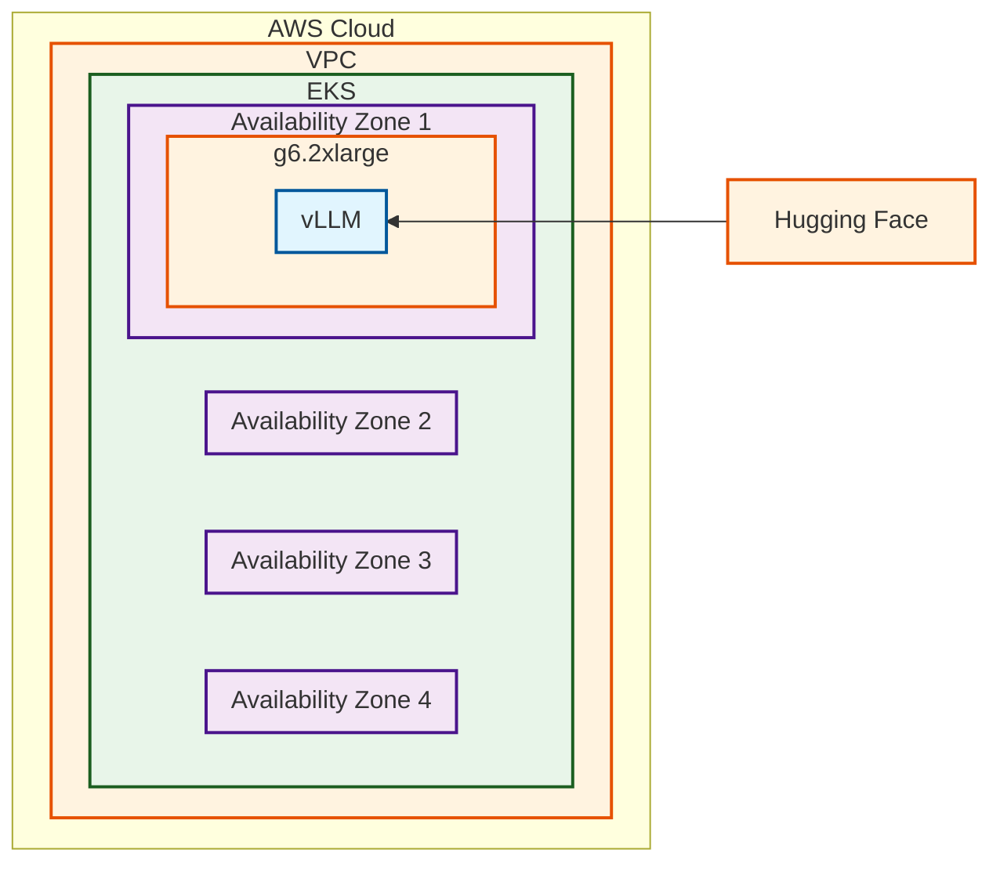

# Model Identification

There are over 250,000 Text Generation models
on [Hugging Face](https://huggingface.co/models?pipeline_tag=text-generation&sort=trending). Finding the right model for
the job can be daunting when getting started with LLM inference. There are a multitude of considerations:

- Accuracy: How well does the model generate text?
- Parameter count: The larger the model is, the more compute is required to run it
- Latency: How long does the model take to run a request? Does it fall within your desired SLOs?
- Licensing: Is the licensing of the model permissive to your use case?
- Customization Capabilities: Can you fine-tune the LLM on your data?
- Capabilities: Does the model work for the task you need?
- Ethical considerations: Is the model trained on data you find ethical? Is the model trained to not answer specific
  questions?

A general rule of thumb is to check an open weights leaderboard such
as [artificialanalysis.ai](https://artificialanalysis.ai/leaderboards/models?open_weights=open_source) to see the
current crop of models. Another possibility is to look at
the [Hugging Face trending models](https://huggingface.co/models?pipeline_tag=text-generation&sort=trending) to see
which ones are the current most popular. Starting with a tiny or small model can highlight a model's capabilities
without requiring a large upfront cost. Once you identify a model to test, you will want to deploy it and test it with a
sample prompt.

Let's take a look at the architecture for that

## Architecture



### Architecture Decisions

Model: [Llama 3.2-1B](https://huggingface.co/NousResearch/Llama-3.2-1B). Llama 3.2 1B is a very small open weights
model.
It supports text generation and is a capable first model for illustrating LLM capabilities.

Inference Engine: [vLLM](https://github.com/vllm-project/vllm). vLLM is a popular, open source, inference engine that is
easy to deploy in a Kubernetes
environment and supports [many models](https://docs.vllm.ai/en/latest/models/supported_models.html). It supports
[multiple accelerators](https://docs.vllm.ai/en/latest/features/quantization/supported_hardware.html), making it a great
way to quickly deploy your first model.

Instance Type: g6.2xlarge. The `g6.2xlarge` instance has an Nvidia L4 accelerator with 24 GiB of video memory. The
instance has 8 vCPUs and 32 GiB of RAM. For the most current pricing, please
see [here](https://aws.amazon.com/ec2/pricing/on-demand/).

It is important to match the instance type to the model you would like to run. If you deviate from this configuration,
that's ok, but you need to keep in mind the memory requirements of an LLM. A general equation is:

$$
Memory=\frac{(Parameters * 4Bytes)}{(32/Modelbits)} * 1.2\\\
\text{Memory = Number of GiB required for Accelerator} \\\
\text{Parameters = Number of parameters in model (e.g. 1B)} \\\
\text{4Bytes = 4 Bytes} \\\
\text{32=32 bits in 4 bytes } \\\
\text{Modelbits=How many bits the model is using } \\\
\text{1.2=20\% overhead for activations }
$$

https://blog.eleuther.ai/transformer-math/

Let's take the Llama 3.2-1B
example ([bf16](https://huggingface.co/NousResearch/Llama-3.2-1B/blob/main/config.json#L31)):
$$
Memory=\frac{(Parameters * 4Bytes)}{(32/Modelbits)} * 1.2\\\
\\\
Memory=\frac{(1B * 4Bytes)}{(32/16)} * 1.2\\\
\\\
Memory=~2.4 GiB
$$

The `g6.2xlarge` has 24 GiB of video memory, which is more than 2.4 GiB, so the model will fit with room to spare.

## Deployment

This deployment assumes you are using
the [Inference Ready Cluster](https://awslabs.github.io/ai-on-eks/docs/infra/inference-ready-cluster) solution, which
supports deployments using multiple frameworks and accelerators.

### Inference Charts

This architecture is available in the AI on EKS [inference charts](../../inference-charts.md). Before deploying the
chart, you will need to create a Hugging Face token and add it to your environment. You can follow the instructions
at  [inference charts](../../inference-charts.md#1-create-hugging-face-token-secret) to create your token.

You will also need to make sure you request access to the [Llama 3.2-1B](https://huggingface.co/meta-llama/Llama-3.2-1B)
model. You will see a link at the top where you can request access. After it is granted, you can run the following:

```bash
cd blueprints/inference/inference-charts
helm template . --values values-llama-32-1b-vllm.yaml | kubectl apply -f -
```

This will deploy the vLLM container, which will pull the weights from Hugging Face and load the model.

## Use the Model

You will want to make sure your container is running with:

```bash
kubectl get po

NAME                                READY   STATUS              RESTARTS   AGE
llama-32-1b-vllm-5ffdcdddcf-gzwnn   0/1     Running             0          2m
```

Once the container is running, you can get the logs on it with

```bash
kubectl logs -l app.kubernetes.io/component=llama-32-1b-vllm -f
```

You will see some output, when you see

```
INFO:     Started server process [7]
INFO:     Waiting for application startup.
INFO:     Application startup complete.
```

the server is running. Press `ctrl + c` to stop following the logs.

You can now port-forward the endpoint to your local computer:

```bash
kubectl port-forward svc/llama-32-1b-vllm 8000
```

In another terminal window, you can now send a request to the model:

```bash
curl --location 'http://localhost:8000/v1/completions' \
--header 'Content-Type: application/json' \
--data '{
    "model": "NousResearch/Llama-3.2-1B",
    "prompt": "Once upon a time, there was a programmer."
}'
```

And you should get a response back:

```bash
{
    "id": "cmpl-ce19e1491f0f4d2ea35ad5d03397e168",
    "object": "text_completion",
    "created": 1755663702,
    "model": "NousResearch/Llama-3.2-1B",
    "choices": [
        {
            "index": 0,
            "text": " That programmer dreamed of creating a program that could do awesome things: analyse data,",
            "logprobs": null,
            "finish_reason": "length",
            "stop_reason": null,
            "prompt_logprobs": null
        }
    ],
    "usage": {
        "prompt_tokens": 11,
        "total_tokens": 27,
        "completion_tokens": 16,
        "prompt_tokens_details": null
    },
    "kv_transfer_params": null
}
```

### Cleanup

When you are done using your model, you can remove it with:

#### Option 1: Inference Charts

```bash
helm template . --values values-llama-32-1b-vllm.yaml | kubectl delete -f -
```

#### Option 2: Manual Removal

```bash
kubectl delete deployment llama-32-1b-vllm
kubectl delete service llama-32-1b-vllm
```

### Summary and Next Steps

Congratulations! You've deployed your first LLM on EKS. From here, you may want to look at a few different paths:

- You may want to test the model on a representative dataset to get a baseline accuracy and performance for the model.
  Take a look at [model testing](./model-testing.md)
- If you are happy with the output of the model, but want to try and optimize its performance more, move on
  to [model optimization](#)
- If the model you'd like to use is bigger than the total GPU memory on the node, you'll want to look
  at [multi-node distributed inference](./multinode-distributed-inference.md)
- If you like the quality of the model and the performance, but are looking for a more robust deployment when more
  traffic comes to it, you will want to look at [autoscaling](./model-scaling.md) the model.
- If you are trying to squeeze the most performance out of the model regarding further optimization, take a look
  at [model productionalization](#)
