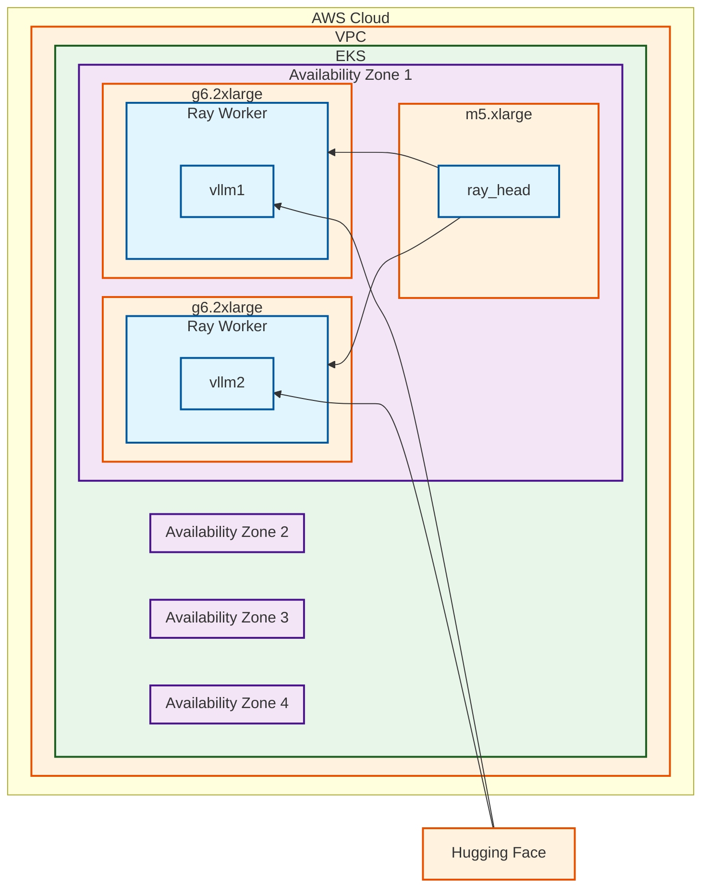

# Model Scaling

Once a model is identified, tested on representative data, optimized, and deployed, it may come time to use more
advanced scaling techniques to 1) save cost on only running the amount of model replicas you need to serve the request
throughput you have, and 2) facilitate scaling up model replicas so your users are not left waiting due to a rush of
requests. The process for dynamically scaling replicas based on demand is known as autoscaling. In this section, we talk
about both Node and Pod autoscaling and how to ensure our service keeps up with the demand placed on it.

# Node Autoscaling

Node autoscaling ensures we do not run more compute than is necessary for our requirements. Node autoscaling is a bit
easier to understand as it is handled entirely by [Karpenter](https://karpenter.sh/). Karpenter is available as part of
the [inference ready cluster](#), but it can also be deployed in other clusters following the instructions. Karpenter
will watch for Kubernetes pods that are not scheduled and will request a new node from AWS that will fulfill the
requests needed. Karpenter does this in a cost-efficient manner as it will look for the most cost-effective node to
faciliate the resource request. If resources are removed from an instance due to workloads terminating, Karpenter will
attempt to scale back the node to stop incurring costs on resources that are no longer needed.

# Model Autoscaling

Model Autoscaling refers to adjusting the number of replicas of a model that are available to serve requests by
monitoring specific metrics. This can be accomplished by adjusting the `replicas` parameter in our deployment through a
combination of tools like [KEDA](https://keda.sh/)
with [Horizontal Pod Autoscaler](https://kubernetes.io/docs/tasks/run-application/horizontal-pod-autoscale/). Another
tool that can be used is [Ray](https://www.ray.io/). Ray combines a built-in queuing mechanism with metrics that can
trigger autoscaling based on different scenarios. Let's first take a look at the architecture

## Architecture

In this architecture, the Ray head `ray_head` pod is running on a CPU instance; this pod is responsible for supporting
the autoscaler; it does not process any requests and therefore does not need a GPU. The Ray head pod will request
additional replicas of the model based on `target_ongoing_requests`. This parameter is the average number of ongoing
request per model replica the autoscaler tries to maintain. As LLMs are non-deterministic and if the sampling parameters
can be configured per request, this parameter becomes a bit harder to predict. Therefore, it is crucial to load test
your configuration with representative loads to ensure the autoscaling is set correctly.

## Replica vs Pod vs Node Autoscaling

Ray provides a bit of flexibility it when it comes to configuring the environment, especially regarding autoscaling. It
is imperative to understand how Ray autoscaling works in a Kubernetes environment. At its core, we're interested in
scaling up our models as quickly as possible to react to a spike in requests. To create a net-new model replica, we need
to download and start a container, download model weights, and load them into memory. With larger LLMs, this process can
take quite a bit of time. The container alone can be 6+ GB and weights can easily top 20 GBs. Just downloading all the
data takes time. Loading the model into memory can take quite a bit of time as well. On top of all that, we also need a
node to put all of this on. Loading a larger model can easily take 10+ minutes. In an ideal scenario, new model replicas
would be available instantly. Having a model available instantly is not possible; however, we can reduce the amount of
time it takes if we understand a few key concepts.

When we use Ray, we create a Ray cluster. Workers join the cluster and bring resources in the form of CPU/Memory/GPUs.
Ray will first consume available resources in the cluster before it will attempt to add new resources through workers.
Workers, in this sense, are pods. If Ray requires a new worker (pod) to be created, as long as there are available
resources in the Kubernetes cluster, Karpenter will not need to request a new node, and artifacts that are already
available on the node (container images) can be reused. Finally, if Ray tries to scale up and the Ray cluster does not
have available resources, it will create a new worker (pod). If there are no available resources available in the
current Kubernetes environment, the pod will be pending. Karpenter will request a new node and a new node will be joined
to the cluster.

With this in mind, let's understand some of the optimizations we can make and their tradeoffs.

# Challenges

- Cold Start
- Resource Skew
