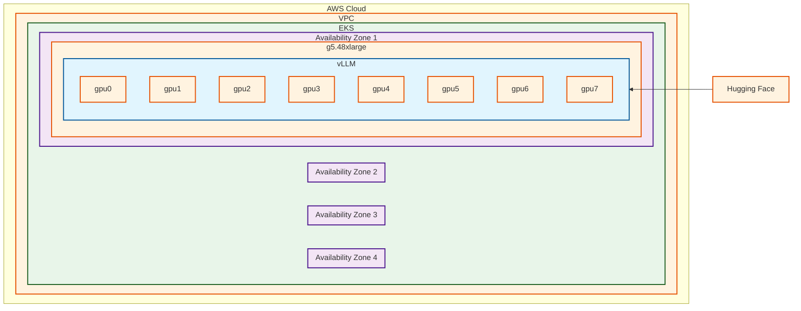
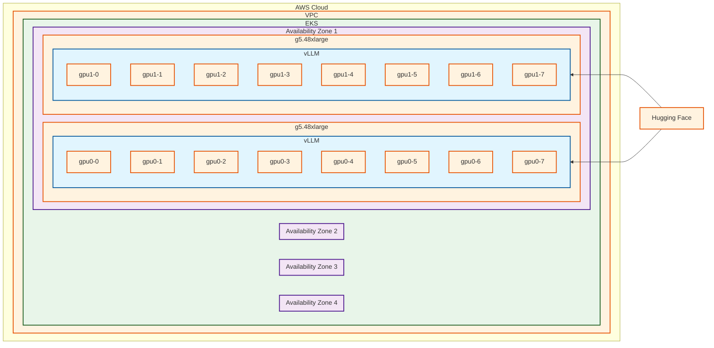

# Multi-GPU/Multi-Node Distributed Inference

Some models are larger than the total amount of memory available on a single GPU. In this case, spreading a model across
multiple GPUs is required to be able to use the model. A single instance has a maximum amount of GPUs, in this case, we
need to spread the model over multiple nodes and multiple GPUs to be able to load the full model for inference. In this
section we will talk about multi-GPU and Multi-node distributed inference.

GPUs have an upper limit on the amount of available memory. At the (current) higher end, an H200 has 141 GB of memory.
Even with all of that memory, there are models that will not fit entirely in one GPU. In this case, the model
computations can be distributed over multiple GPUs in a single node. This is called Tensor Parallelism and is a
configurable setting when deploying LLMs for inference.

Caveat: The number of attention heads of the model need to be evenly divisible by the number of GPUs used for tensor
parallelism. For instance, Llama 3 8B has 32 attention heads (Table
3; [The Llama 3 Herd of Models](https://ai.meta.com/research/publications/the-llama-3-herd-of-models/)). This number
needs to be divisible by the number of GPUs used for tensor parallelism. Most instances have 1,2,4,or 8 GPUs, so this is
not a problem, but if one GPU were to be reserved for a different use, it would not be possible to set the tensor
parallelism value to 7 or 3.

If the total available GPU memory of the instance is still not enough for the model, a combination of Tensor Parallelism
and Pipeline Parallelism can be used to distribute both the intra-layer computation (tensor parallelism) and the layers
themselves (pipeline parallelism) over multiple instances and GPUs.

Considerations:

- cost
    - could be less because you can use smaller instances
    - could be more because of network egress
- latency
    - completing the request over multiple nodes adds latency
- ensure using the same instance types

# Tensor Parallelism

The [inference-charts](../../inference-charts.md) have an example for a
quantized [Llama 4 Scout](https://github.com/omrishiv/ai-on-eks/blob/begin-inference-guidance/blueprints/inference/inference-charts/values-llama-4-scout-17b-vllm.yaml).
This model cannot fit onto a single GPU, but it can fit onto 8.

## Architecture

# Pipeline Parallelism

The [inference-charts](../../inference-charts.md) have an example for a full Llama 4 Scout deployment that uses multiple
nodes. Llama 4 Scout is a 17B parameter model with 16 experts. The full model needs over 200 GB of GPU memory. If we
were to use an A10 or L4, this would require more than 8 GPUs. That's not possible in 1 instance, but is possible in 2.

## Architecture

