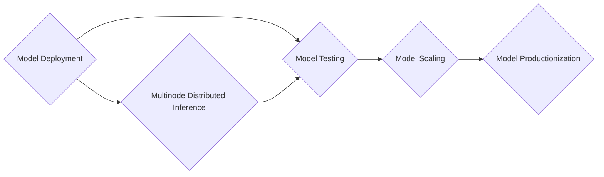

# Inference on EKS

AI on EKS provides comprehensive solutions for deploying AI/ML inference workloads on Amazon EKS, supporting both GPU
and AWS Neuron (Inferentia/Trainium) hardware configurations. Whether you are just getting started with inference or are
trying to run global inference at scale, AI on EKS has you covered.

We understand that everyone is at a different point in their inference journey. To that end, AI on EKS aims to provide
you with suggestions on where to start, how to evaluate the guidance with your own data, practical optimization
techniques, and where to go next. We see a common journey most customers go through:

Inference on EKS is split into the following sections: ML inference and AI inference. Navigating the complexity of different use cases, model types, inference engine, framework, and accelerator can be
really daunting. AI on EKS aims to aid in identifying the proper tool for the job, providing suggestions and
alternatives, while providing you the techniques you need to apply it directly to your use case to test.

## ML Inference

ML Inference employs simpler algorithms such as decision trees, logistic regression, support vector machines (SVMs) and
shallow neural networks. These networks tend to work very well on CPUs and smaller GPUs and do not require the
processing power of modern, larger network architectures.

## AI Inference

AI Inference leverages complex neural architectures such as Transformers and Diffusion to support tasks such as text
prediction and image generation.

### Large Language Models (LLMs)

LLMs are a type of model that is trained to understand meaning and context from human language and then generate or
manipulate text. These types of models excel at translation, answering questions, summarizing text, or creative writing.
To get started with these models, head over to the [LLM](./ai/llm/model-identification.md) section.

### Diffusion

Diffusion models are models that learn how to generate information through a process of learning that iteratively adds
more noise/obfuscation to the data as the model gets better. These models are adept at generating images, audio, and
video from a textual prompt. Learn more about these models in the [diffusion](#) section.

## Getting Started

### Inference-Ready EKS Cluster

The [Inference-Ready EKS Cluster](../../infra/inference-ready-cluster.md)

### 🚀 Inference Charts

Get started quickly with our pre-configured Helm charts that support multiple models and deployment patterns:

- **[Inference Charts](./inference-charts.md)** - Streamlined Helm-based deployments with pre-configured values for
  popular models
- Supports both GPU and Neuron hardware
- Includes VLLM and Ray-VLLM frameworks
- Pre-configured for 10+ popular models including Llama, DeepSeek, and Mistral

## Architecture Overview

AI on EKS inference solutions support multiple deployment patterns:

- **Single-node inference** with vLLM
- **Distributed inference** with Ray-vLLM
- **Production-ready** deployments with load balancing
- **Auto-scaling** capabilities
- **Observability** and monitoring integration

## Next Steps

1. **Start with [Inference Charts](./inference-charts.md)** for the fastest path to deployment
2. **Explore hardware-specific guides** for optimized configurations
3. **Set up monitoring and observability** for production workloads
